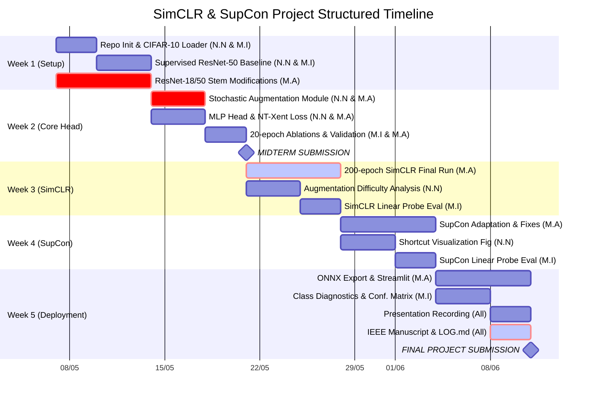

# SimCLR-Vision-SSL

> **Self-Supervised & Semi-Supervised Contrastive Learning for Visual Representations**  
> A research-grade implementation of SimCLR and SupCon on CIFAR-10, featuring a 42-experiment augmentation ablation suite, shortcut-learning analysis, linear evaluation protocol, and a live real-time visual similarity search engine.

[](https://python.org)
[](https://pytorch.org)
[](LICENSE)
[]()
[]()
[](https://huggingface.co/spaces/mahmoudalyosify/SimCLR-Visual-Search-Engine)
[](https://api.wandb.ai/links/models-queen-s-university/6f2t0db2)

---

## Live Demo

**Try the visual search engine — no installation required:**

**[https://huggingface.co/spaces/mahmoudalyosify/SimCLR-Visual-Search-Engine](https://huggingface.co/spaces/mahmoudalyosify/SimCLR-Visual-Search-Engine)**

Upload any image or pick a random CIFAR-10 test image and retrieve the 5 most semantically similar images in under 5 ms using the ONNX-exported ResNet-50 encoder + FAISS index.

---

## Overview

This repository implements **SimCLR** ([Chen et al., ICML 2020](https://arxiv.org/abs/2002.05709)) and **Supervised Contrastive Learning (SupCon)** ([Khosla et al., NeurIPS 2020](https://arxiv.org/abs/2004.11362)) for self-supervised and semi-supervised visual representation learning on CIFAR-10.

**Key Contributions:**

- **42-Experiment Augmentation Ablation Suite** — Systematic sweep over spatial, photometric, and structural transforms, identifying `Exp 41` (Crop + Flip + GaussianBlur + ColorJitter) as the optimal configuration (NT-Xent = 4.9906, linear probe **84.30%**).
- **Color-Jitter Shortcut Mitigation Study** — 5 paired 200-epoch ResNet-50 experiments demonstrating that NT-Xent loss is an unreliable proxy for representation quality. Color Jitter alone yields a mean **+18.10 pp** accuracy gain with zero architectural changes.
- **Architecture** — ResNet-50 modified with a custom small-image stem (`Conv2d 3×3, stride 1`, no max-pooling) following Chen et al. Appendix B.9, preserving spatial resolution for 32×32 inputs.
- **Contrastive Frameworks**:
  - *Unsupervised (SimCLR):* Two-layer MLP projection head + NT-Xent loss (τ = 0.5).
  - *Semi-supervised (SupCon):* Supervised Contrastive Loss (τ = 0.1) on a stratified 10% subset (5,000 labeled samples). Six iterative debugging runs required to stabilize training — see [SupCon Diagnostics](#supcon-training-diagnostics) below.
- **Real-Time Visual Search Engine** — ResNet-50 encoder exported to **ONNX** (max deviation `3.81×10⁻⁶` from PyTorch reference) paired with **FAISS `IndexFlatIP`** for exact sub-5 ms similarity retrieval over 10,000 CIFAR-10 test embeddings.
- **Interactive Web GUI** — Streamlit application with real-time visual similarity search and ablation dashboard.

---

## Results

| Method | Backbone | Labels | Epochs | Top-1 Acc | Notes |
|--------|----------|--------|--------|-----------|-------|
| Supervised End-to-End | ResNet-50 | 100% | 90 | **93.77%** | Supervised ceiling |
| Linear Probe — Supervised Encoder | ResNet-50 | 100% | 50 (probe) | **93.89%** | Pipeline sanity check |
| **SimCLR — Exp 41 (Best Config)** | **ResNet-50** | **0%** | **200** | **84.30%** | Crop+Flip+GaussianBlur+ColorJitter |
| SupCon — Semi-supervised | ResNet-50 | 10% | 100 | **75.20%** | 5,000 stratified labels |
| SimCLR — Midterm PoC (Exp 8) | ResNet-18 | 0% | 20 | **72.14%** | Proof-of-concept ablation |
| CLIP Zero-Shot (Upper Bound) | ViT-B/32 | 0% | — | **88.80%** | Pretrained on 400M image–text pairs |
| SimCLR — Chen et al. (paper) | ResNet-50 | 0% | 1000 | 94.00% | Academic benchmark |
| SupCon — Khosla et al. (paper) | ResNet-50 | 100% | — | 96.00% | Academic benchmark |

> Our SimCLR encoder, trained exclusively on 50,000 unlabeled 32×32 CIFAR-10 images, reaches **95% of CLIP ViT-B/32 zero-shot accuracy** while using 8,000× less training data.

---

## Key Findings

### 1. Augmentation Hierarchy

The 8-configuration ablation reveals a clear three-tier loss hierarchy at 20 epochs (ResNet-18, BS=128):

| Tier | Configs | Augmentations | L₂₀ |
|------|---------|--------------|-----|
| 1 | Exp 1–2 | Spatial only (Crop, Flip) | ≈ 3.73 |
| 2 | Exp 3–6 | + one chromatic transform | ≈ 3.87 |
| 3 | Exp 7–8 | Full photometric pipeline | ≈ 3.95–3.97 |

Higher absolute NT-Xent loss reflects a harder contrastive task — not worse learning. Exp 8 (Full SimCLR pipeline) achieves the largest loss reduction (ΔL = 0.916) and the most semantically structured t-SNE embeddings.

### 2. Color Jitter Shortcut Mitigation

Five structural pipelines were trained twice at full scale (ResNet-50, 200 epochs, BS=512) — once without and once with `RandomApply([ColorJitter(0.8, 0.8, 0.8, 0.2)], p=0.8)`:

| Exp (Base → +Jitter) | Pipeline | Base Acc | +Jitter Acc | Gain (pp) | Rel. |
|----------------------|----------|----------|-------------|-----------|------|
| Exp 36 → 38 | Pure Discrete Rotation | 34.40% | 51.21% | +16.81 | +48.9% |
| Exp 35 → 39 | Weak Spatial Baseline | 59.22% | 80.53% | +21.31 | +36.0% |
| Exp 9 → 40 | Crop + GaussianBlur | 63.01% | 80.65% | +17.64 | +28.0% |
| **Exp 13 → 41** | **Crop + Flip + Blur** | **64.49%** | **84.30%** | **+19.81** | **+30.7%** |
| Exp 10 → 42 | Crop + Random Cutout | 66.27% | 81.21% | +14.94 | +22.5% |
| — | **Mean** | — | — | **+18.10** | **+33.2%** |

**Critical finding:** All five base pipelines converge to nearly identical NT-Xent losses (≈ 4.95–4.96) yet span a **31.87 pp accuracy range** (34.40%–66.27%). Without Color Jitter, encoders exploit color-histogram shortcuts rather than learning semantic structure. Color Jitter eliminates this shortcut, raising initial losses by ~1 nat and forcing structural reasoning.

### 3. SupCon: Why 10% Labels Underperforms Zero-Label SimCLR

SupCon-10% (75.20%) falls below SimCLR (84.30%) despite having label information. The cause is **reduced semantic diversity**: restricting pretraining to 5,000 images limits intra-class variation, making it harder to learn class-consistent invariances. The batch composition (class positives per batch) remains approximately unchanged due to the fixed batch size and balanced CIFAR-10 distribution — the loss floor rises because the representation manifold is harder to align, not because of fewer positives.

---

## Architecture

**ResNet-50 with CIFAR-10 stem** (Chen et al. Appendix B.9):

```
Input (32×32×3)
    │
    ├── [Augmentation t  ~ T] → x_i ─┐
    └── [Augmentation t' ~ T] → x_j ─┤
                                      │
                        Encoder f(·) — ResNet-50
                        ┌──────────────────────────┐
                        │ Conv2d(3→64, 3×3, s=1)   │  ← replaces 7×7 stride-2 stem
                        │ BatchNorm → ReLU          │
                        │ Identity (no MaxPool)     │  ← removed per Appendix B.9
                        │ Layer1 → 2 → 3 → 4        │
                        │ AvgPool                   │
                        └──────────────────────────┘
                                      │  h ∈ ℝ²⁰⁴⁸
                                      │
                        Projection Head g(·) — MLP
                        ┌──────────────────────────┐
                        │ Linear(2048 → 2048)       │
                        │ BatchNorm → ReLU          │  ← BN in hidden layer ONLY
                        │ Linear(2048 → 128)        │  ← no final BN (causes collapse)
                        └──────────────────────────┘
                                      │  z ∈ ℝ¹²⁸ → ℓ₂-norm
                                      │
                    NT-Xent Loss (τ=0.5, 1,023 in-batch negatives)

    ── After pretraining: discard g(·), freeze f(·) ──
                                      │  h ∈ ℝ²⁰⁴⁸
                                      │
                        nn.Linear(2048 → 10) → 84.30% Top-1
```

**Critical implementation detail:** Applying BatchNorm to the projection output *and* subsequently applying ℓ₂-normalization constitutes double normalization that collapses all embeddings to a single point (confirmed empirically in SupCon runs 4–5). BatchNorm must be placed in the hidden layer only.


https://github.com/user-attachments/assets/54d31900-914f-4111-af39-356b416ed9ec


---

## SupCon Training Diagnostics

Six iterative runs were required to stabilize SupCon training. Each failure mode independently prevented any learning.

| Run | Key Change | L₁ | L₁₀₀ | Status |
|-----|------------|----|-------|--------|
| 1 | AdamW lr=0.5, FP16 | 6.93 | NaN | FAIL — FP16 overflow |
| 2 | AdamW lr=0.5, FP32 | 2.31 | 2.31 | FAIL — Stuck at log(10) |
| 3 | SGD lr=0.05, wrong loss formulation | 2.31 | 2.31 | FAIL — Plateau |
| 4 | Correct loss, final BatchNorm | 7.44 | 6.93 | FAIL — Representation collapse |
| 5 | Official loss, τ=0.07 | 7.44 | 6.93 | FAIL — Representation collapse |
| **6** | **Official loss, τ=0.1, per-step warmup** | **6.93** | **4.98** | **SUCCESS** |

**Root causes:**

- **Run 1 (NaN):** `exp(1.0/0.1) = e¹⁰ ≈ 22,026`; FP16 overflows at `e^11.09 ≈ 65,504`. Solution: disable AMP entirely (FP32 throughout).
- **Runs 2–3 (L = 2.31 = log(10)):** AdamW lr=0.5 is ~167× the typical maximum; gradient updates destroy all learned structure from step 1, leaving the model at the uniform-class fixed point.
- **Runs 4–5 (L = 6.93 = log(1023)):** Final BatchNorm + subsequent ℓ₂-normalization = double normalization, over-constraining the representation manifold.
- **Run 6:** Remove final BN + τ=0.1 + per-step SGD warmup from lr=0.01 → resolves all failure modes simultaneously.

---
## Quick Start

### Run the Visual Search Engine (No Retraining Needed)

```bash
pip install streamlit onnxruntime faiss-cpu numpy pillow torch torchvision matplotlib scikit-learn
streamlit run app.py
```

### SimCLR Pretraining — Best Config (Exp 41)

```bash
python src/train_master.py \
  --epochs 200 \
  --batch_size 512 \
  --backbone resnet50 \
  --exp_id 41
```

### SupCon Pretraining — 10% Labels

```bash
python train_supcon.py \
  --epochs 100 \
  --batch_size 512 \
  --fraction 0.1 \
  --learning_rate 0.05
```

---

## Training Configuration

| Parameter | Supervised | SimCLR | SupCon |
|-----------|------------|--------|--------|
| Backbone | ResNet-50 | ResNet-50 | ResNet-50 |
| Batch size | 256 | 512 | 512 |
| Optimizer | SGD + Nesterov | AdamW | SGD + momentum |
| Peak LR | 0.1 | 0.06 | 0.05 |
| Weight decay | 1e-4 | 1e-4 | 1e-4 |
| Warmup epochs | 5 | 10 | 10 (per-step) |
| LR schedule | Cosine | Cosine | Cosine |
| Temperature τ | — | 0.5 | 0.1 |
| Epochs | 90 | 200 | 100 |
| Mixed precision | FP16 | FP16 | **FP32** |
| Random seed | 42 | 42 | 42 |
| Hardware | RTX 5000 Ada | RTX 5000 Ada | RTX 5000 Ada |

> **Note — SupCon uses FP32:** with τ=0.1, `exp(z·z/τ)` can reach `e¹⁰ ≈ 22,026`, which approaches the FP16 overflow threshold of 65,504.

---

## Repository Structure

```
SimCLR-Vision-SSL/
├── app.py                          # Streamlit visual search engine & ablation GUI
├── build_faiss.py                  # Extracts 2048-d features and builds FAISS index
├── export_onnx.py                  # Exports Exp 41 ResNet-50 weights to ONNX
├── train_supcon.py                 # SupCon Stage 1 pretraining orchestrator
├── loss_supcon.py                  # Supervised Contrastive Loss implementation
├── dataset_subset.py               # Stratified data sampler (10% / 100% labels)
├── run_ablations.py                # Runs all ablation configs sequentially
│
├── src/                            # Core source modules
│   ├── augmentations.py            # 42 augmentation pipelines (Exps 1–42)
│   ├── dataset.py                  # DataLoader builders for training & evaluation
│   ├── loss.py                     # NT-Xent loss implementation
│   ├── model.py                    # ResNet-50/18 encoder with custom CIFAR-10 stem
│   └── train_master.py             # Master contrastive training loop (AMP, W&B)
│
├── deployment/                     # Production assets for Streamlit GUI
│   ├── simclr_encoder_exp41.onnx   # ONNX encoder (~89.6 MB, max deviation: 3.81e-6)
│   ├── cifar10_index.faiss         # FAISS IndexFlatIP (10,000 vectors)
│   ├── metadata.json               # Vector ID → class name / image path
│   └── test_images/                # 10,000 reference CIFAR-10 PNG images
│
├── outputs/                        # Checkpoints from training runs
│   ├── supcon_resnet50_frac10_.../  # SupCon 10% checkpoint
│   └── supcon_resnet50_frac100_.../ # SupCon 100% checkpoint
│
├── main-Final-SimCLR Report.tex    # LaTeX source of the final IEEE report
├── requirements.txt                # Full dependency list
└── LOG.md                          # Development log with AI usage disclosure
```

---

## Experiment Tracking

All 42 experiments tracked on **Weights & Biases** with per-epoch NT-Xent loss, learning rate schedule, GPU utilization, wall-clock time, and t-SNE projections at checkpoints. Fixed seed 42 across Python, NumPy, and PyTorch ensures bitwise-reproducible results.

**[View W&B Dashboard](https://api.wandb.ai/links/models-queen-s-university/6f2t0db2)**

---

## Project Timeline



---

## Team

| Name | Role |
|------|------|
| **Natalie Nashed** | Data Augmentation Lead — 42-experiment pipeline design, positive-pair visualization, three-tier difficulty hierarchy analysis, shortcut visualization figure |
| **Mahmoud Alyosify** | Contrastive Framework Lead — ResNet-50/18 encoders, NT-Xent loss, full SimCLR training loop (AMP, W&B), SupCon (6 diagnostic runs), ONNX + FAISS + Streamlit deployment |
| **Mirna Imbabi** | Linear Evaluation Lead — supervised baseline (93.77%), frozen-encoder probing protocol, confusion matrix, per-class diagnostics, final report assembly |


**Course:** CISC 867 Deep Learning, Queen's University, Spring 2026 

**Hardware:** NVIDIA RTX 5000 Ada Generation (34.4 GB VRAM)

---

## References

```bibtex
@inproceedings{chen2020simple,
  title     = {A Simple Framework for Contrastive Learning of Visual Representations},
  author    = {Chen, Ting and Kornblith, Simon and Norouzi, Mohammad and Hinton, Geoffrey},
  booktitle = {ICML},
  year      = {2020}
}

@inproceedings{khosla2020supervised,
  title     = {Supervised Contrastive Learning},
  author    = {Khosla, Priyank and Teterwak, Piotr and Wang, Chen and others},
  booktitle = {NeurIPS},
  volume    = {33},
  year      = {2020}
}
```

Licensed under the [MIT License](LICENSE).
